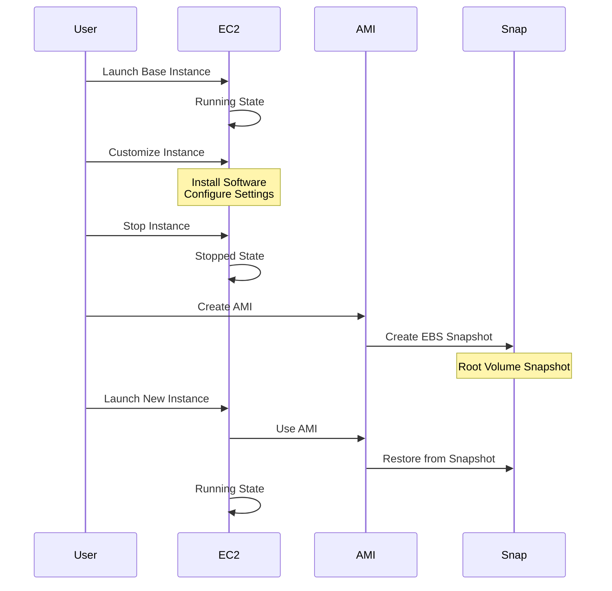

2025-04-27 09:04

Tags: [[AWS EC2]]

---

# General
- Amazon Machine Image
- Are customization of EC2 instance
	- Add your own software, config, OS, monitoring
	- Faster boot/config <- all software are pre-paareckaged
- AMIs are built for specific religion (but can be copy to others)
- Can launch EC2 instances from:
	- A Public AMI provided by AWS
	- You own AMI: you create and manage 
	- AMI from marketplace: someone else made/sell
# Process
- Start an EC2 instance
- Customize it
- Stop it
- Build the AMI (this will also create EBS snapshot)
- Launch other instances from that AMI

# Hand-on
- Create AMI from instance:
![[Pasted image 20250427093427.png]]
- View AMIs list
![[Pasted image 20250427093641.png]]
- 

---
# References