2025-04-07 16:29

Tags: [[AWS]] [[Networking]]

---

- Elastic Network Interface
- A logical component in [[Amazon VPC]] that represent [[virtual network card]]
- Each ENI has following attributes:
	- 1 primary private [[IPv4]]
	- 1 or more secondary IPv4
	- 1 Elastic IP per private IPv4
	- 1 Public IPv4
	- 1 or more [[Security group]]
	- A [[MAC address]]
- Can create ENI independently and attach them on the fly on EC2 instances for failover
- ENI is bounded to a specific AZ

# How to?
- Create new ENI
- Attach it to instance

# Use cases
- Network security
	- Different security groups for different types of traffic
		- Web traffic (ports 80/443) on one ENI
		- Database traffic (port 3306) on another ENI
		- Database traffic (port 3306) on another ENI
- Multiple network
	- Connect to different subnets
	- Access to different VPCs
	- Mix of public and private networks
	- Different routing rules per interface
- Low-budget high-availability
	- Move ENI to backup instance during failure (Keep same IP address when moving) -> quick recovering
- Dual-homed instances
	- Instance present in multiple subnets

```mermaid
graph TB
    subgraph "Common ENI Use Cases"
        direction TB
        
        subgraph "Basic Network"
            ENI1["Primary ENI<br/>For regular traffic"]
        end
        
        subgraph "Management Network"
            ENI2["Secondary ENI<br/>For admin access"]
        end
        
        subgraph "Different Security Groups"
            SG1["🔒 Web Traffic<br/>Ports 80,443"]
            SG2["🔒 Admin Traffic<br/>Port 22"]
        end
        
        ENI1 --> SG1
        ENI2 --> SG2
    end
```

---
# References