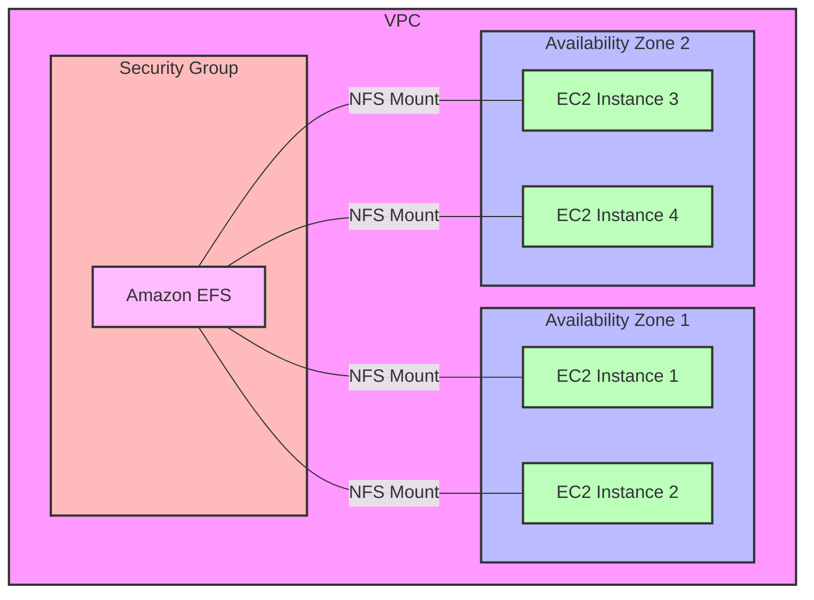

2025-05-06 10:02

Tags: [[Amazon VPC]]

---

- Elastic File System
- Is managed [[NFS]] (network file system)
- Can be mounted on many [[AWS EC2]] instances in multi-AZ
- High <mark style="background: #BBFABBA6;">availability</mark> and <mark style="background: #BBFABBA6;">scalability</mark>, but <mark style="background: #FFB8EBA6;">expensive</mark>, 
- ==Pay per use== and scale automatically 
- Use cases:
	- Content management
	- Web serving
	- Data sharing
	- Wordpress
- Use NFSv4.1 protocol
- Use [[Security group]] to control access
- Compatible with ==Linux-based AMI== (not Windows)
- Encryption at rest using [[KMS]]
- [[POSIX file system]] (~Linux) that has a standard file API

# EFS Classes
## Performance classes
- EFS scale:
	- 1000s concurrent NFS clients, 10GB+/s throughput
	- Auto scale to PB-scale NFS
- Performance mode:
	- General Purpose (default value): use for latency-sensitive cases (web server, CMS,...)
	- Max I/O: <mark style="background: #FFB8EBA6;">higher latency</mark>, <mark style="background: #BBFABBA6;">throughput and parallel</mark> (big data, media process)
- Throughput mode:
	- Bursting: 1TB = 50MiB/s + burst up to 100MiB/s
	- Provisioned: set throughput ==regardless of throughput==
	- Elastic: scale automatically based on the workload (Up to 3GiB/s for read and 1GiB/S for writes)
## Storage classes
- Storage Tiers:
	- Standard: for frequently accessed files
	- EFS-IA: infrequent access files, more costly to retrieve, less to store
	- Archive: rarely access data (few times per year), much cheaper

> [!i] Can implement the lifecycle policies to move files between tiers

- Availability and durability:
	- Standard (Regional): 
		- multi AZs
		- great for prod
	- One Zone:
		- One AZ only
		- Great for dev, back up enabled by default
		- Compatible with IA

# Hand on
## Create new file system
### 1. File System setting
![[Pasted image 20250506170320.png]]
### 2. Network access setting

> [!i] Best practices:
> - AWS suggests creating 1 mount target for each AZ
> - Create the separate SG for the EFS

![[Pasted image 20250506171240.png]]
### 3. File system policy (optional)

## Attach to EC2 instance
- Remember to ==select subnet first== to be able to select EFS
![[Pasted image 20250507083810.png]]
- Select EFS
![[Pasted image 20250507083900.png]]

---
# References