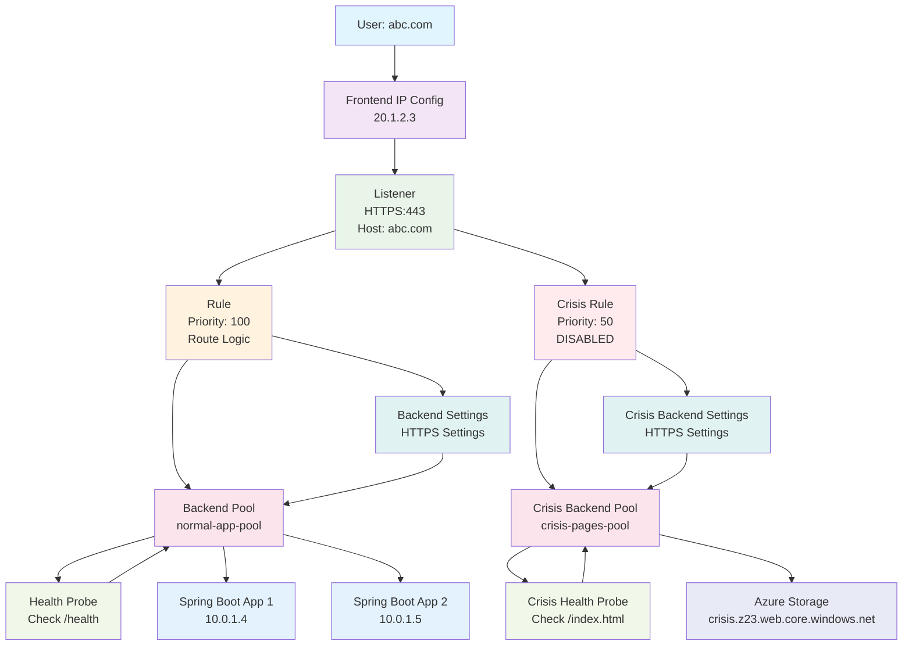

2025-07-10 09:29

Tags: [[Application Gateway]]

---

```mermaid
graph TD
    A[User: abc.com] --> B[Frontend IP Config<br/>20.1.2.3]
    B --> C[Listener<br/>HTTPS:443<br/>Host: abc.com]
    C --> D[Rule<br/>Priority: 100<br/>Route Logic]
    D --> E[Backend Pool<br/>normal-app-pool]
    D --> F[Backend Settings<br/>HTTPS Settings]
    F --> E
    E --> G[Health Probe<br/>Check /health]
    G --> E
    E --> H[Spring Boot App 1<br/>10.0.1.4]
    E --> I[Spring Boot App 2<br/>10.0.1.5]
    
    %% Crisis Mode Path
    C --> J[Crisis Rule<br/>Priority: 50<br/>DISABLED]
    J --> K[Crisis Backend Pool<br/>crisis-pages-pool]
    J --> L[Crisis Backend Settings<br/>HTTPS Settings]
    L --> K
    K --> M[Crisis Health Probe<br/>Check /index.html]
    M --> K
    K --> N[Azure Storage<br/>crisis.z23.web.core.windows.net]
    
    %% Styling
    style A fill:#e1f5fe
    style B fill:#f3e5f5
    style C fill:#e8f5e8
    style D fill:#fff3e0
    style E fill:#fce4ec
    style F fill:#e0f2f1
    style G fill:#f1f8e9
    style H fill:#e3f2fd
    style I fill:#e3f2fd
    style J fill:#ffebee
    style K fill:#fce4ec
    style L fill:#e0f2f1
    style M fill:#f1f8e9
    style N fill:#e8eaf6
```

---
# References