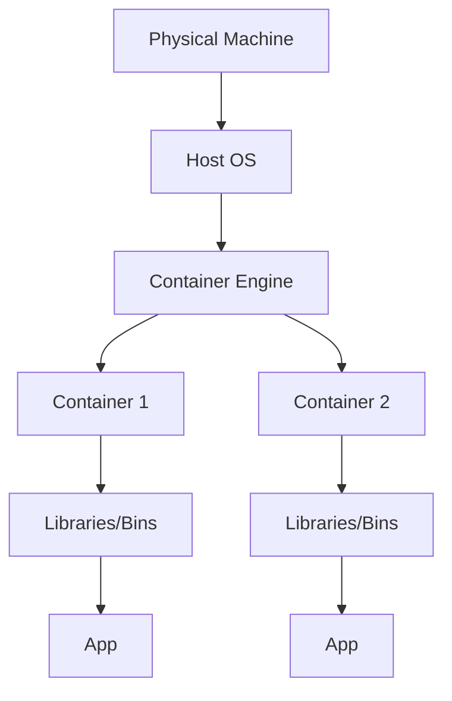

2025-07-24 20:15

Tags: [[Azure Cloud]] 

---

- Unlike [[Virtual Machine]] which is like a physical machine, containers are ==self-contain software packages==, which have everything needed for an application
- It's portable - can run consistently on different computers or cloud environment
- Run in systems that have container engines like Docker
- ==Cost per second== of running container
# Architecture

# Advantages
- Isolation: each container contain all things needed for the application to run, which means
	- Speed: container can be quickly start up 
	- Portable: ca be run the same in different platform or different cloud vendor
# Fields when create container
## Basic
- Project details:
	- Subscription: which subscription will be charged
	- [[Resources Group]]
- Container detail:
	- Name
	- Region
	- Image type: public/private
	- Image name
	- Image source:
		- Quick start images
		- [[Azure Container Registry (ACR)]]
		- Docker Hub or other registry
	- OS type: windows/linux
	- Size:
		- Number of CPU cores
		- Memory (GiB)
		- GPU type
## Networking
- Ports: which port to access to the container, each contain:
	- Port
	- Port Protocol
- DNS name label
## Advanced
- Restart policy: 
	- Always: always auto restart after the container stopped for any reason
	- On failure: only restart if exit with non-zero exit code (if exit successfully with exit code 0 -> not auto restart)
	- Never
- Environment variables

# Fields after created container
- [[FQDN]]
- [[IP address]]
- Events: Created, Started, Pulling, Pulled,...
- Properties
- Logs
- Connect: to connect to the bash of container

---
# References
- [[Container vs VM]]