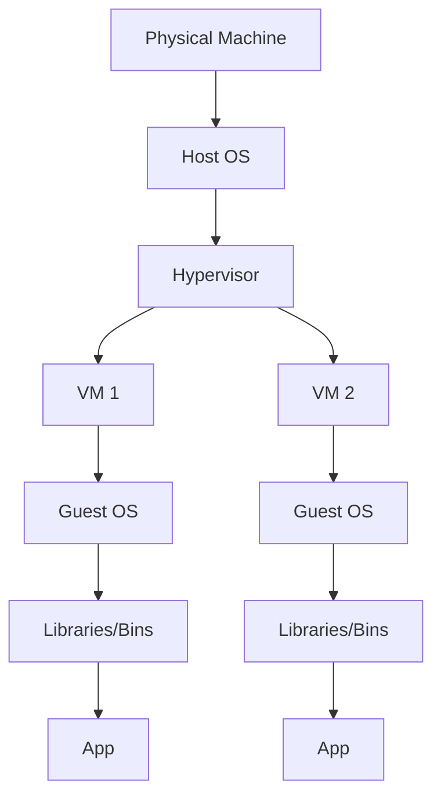

2025-07-10 21:10

Tags: [[Azure Cloud]] 

---

- Virtualization: software-defined abstraction:
	- Introduces software layer ([[Hyper visor]])
	- Could simulate multiple hardware environment in a single machine
- VM: a software emulation of a computer
	- Has virtual CPU/memory/storage/networking
- Benefits:
	- Resource maximization by host multiple VM in 1 machine
	- Each VM could run different OS and application
	- Increase flexibiliy: easily to create, move, delete VMs
	- Disaster Recovery: VMs could be easily replicated to other machine if a machine got problem

# Architecture

# Attributes when create Azure VM
## General Setting
- Project detail
	- Subscription: to manage cost
	- Resource group
- Resource details:
	- VM name
	- Region
	- Availability options:
		- [[Azure Availability Zones]]
		- VM scale set
		- [[Availability Sets]]
	- Security types:
		- Standard
		- Trusted launch VMs
		- Confidential VMs
	- Images: Linux, Windows,...
	- VM architecture: x64, Arm65
	- Run with [[Azre Spot]] discount
	- Size: CPUs, memory,...
- Adminstrator account:
	- Auth type: password, SSH key
	- Username
	- Password
- Inbound ports rules: which VM network ports are accessible from the internet: HTTP (80), [[RDP]] (3389)
- Licensing: If you already has licensce with Microsoft, no need to pay for that again

## Disks
- VM disk encryption: automatically encrypt the data that stored on Azure managed disk when saved to the cloud
- OS disk:
	- Size: how much data to be stored
	- Type: performance characteristic
- Delete with VM?
- (Encryption) Key management: platform-managed, customer-managed
- Enable ultra disk compatibility:
	- Allow virtual disk to leverage high perf features: [[NVE]]
- Data disks: can create new or attach the one created before

## Networking
- Network interface
	- Virtual network: choose which [[Virtual Network]] that the VM is in
	- Subnet: which subnet ([[IP ranges]]) the VM should go
	- Public IP: which IP to connect to the VM via internet (if none, only can access via VPN/ [[Bastion Host]])
	- [[NIC]] Network security group ([[Azure Network Security Group]])
	- Inbound ports: which ports are exposed to external
	- Enable accelerated networking:
		- Not available in all VM
		- Increase the network speed
- Load balancing: Distribute the incoming network across multiple VMs

## Management
- Microsoft defender cloud
	- Provides security service like vulnerability scanning, threats detect
- Identity
	- Enable system assigned managed identity: identity is auto-created by the platform -> be used to access other resources
	- Login with Microsoft EntraID
	- Auto shutdown:
		- Fixed shutdown time
		- Shutdown based on inactivity
	- Enable Backup
	- Enable Disaster Recovery: replicated and failover

## Monitoring
- Alert: Notify when specific condition met:
	- CPU higher than
	- Available memory less than
	- Data disk [[IOPS]] percentage greater than
	- Network in/out total greater than
- Diagostic: dianose issue with the VM 
	- Boot diagnostic
	- Enable guest OS diagnostic: let the OS's diagnostic services running
	- Things used to diagnose:
		- Resource utilization info
		- Error logs
- Health: enable health check for VM via protocols, port, path,...
## Advanced options
- Extensions: add new features to the machine
	- Could come from microsoft, other 3-parties or self develop
	- Features: backup utilities, diagnostic tools, management tools
- Applications: can select apps to be installed
- Custom data: allow pass a script, config file or other data to the VM -> be trigged at run time
- User data: allow pass a script, config file or other data to the VM -> be trigged when user log in
- Host group: when you want a physical server
- Capacity reservation: benefit for workloads that require predictable requirement of CPU, memory
- Proximity placement group: to group resource physically closer together in same region

## Tags
- Tags are key-value pairs defined by users
- Used to categorize VMs to better managing

# Other details after created
- Public [[IP address]]: could be used to access t the VM

---
# References