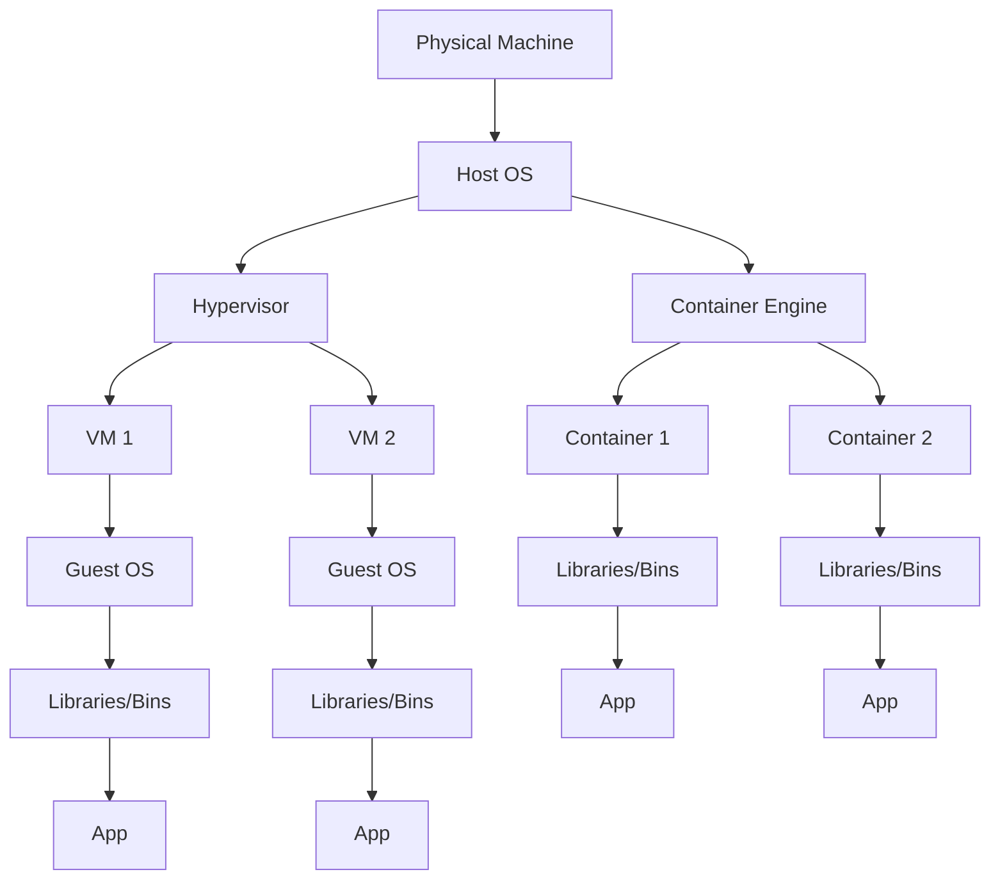

2025-07-24 20:22

Tags: [[Devops]] 

---

| Feature         | VM                                                                                                                                                                                    | Container                                                                                       |
| --------------- | ------------------------------------------------------------------------------------------------------------------------------------------------------------------------------------- | ----------------------------------------------------------------------------------------------- |
| Concept         | Full-computer emulation                                                                                                                                                               | Software                                                                                        |
| Includes        | OS. apps and dependencies                                                                                                                                                             |                                                                                                 |
| Resource usage  | Use more, suitable for heavier overhead                                                                                                                                               |                                                                                                 |
| Start-up speed  | Slower                                                                                                                                                                                |                                                                                                 |
| Portability     | Less, may require config changes                                                                                                                                                      | Highly, run consistently in different machine                                                   |
| Use cases       | - Want control over OS - Demand strong isolation between applications - Legacy applic - Modern, cloud-native apps - Microservices architecture - Prioritizing portability |                                                                                                 |
| Security        | - Better because each VM has it own OS                                                                                                                                                |                                                                                                 |
| Deployment      | - Deploy individual VM using windows admin center or Hyper-V or VMware or Powershell or System Center VM manager                                                                      | - Multiple containers could be deployed using orchestration service such as Azure K8S           |
| Storage         | - Virtual hard disk for local storage - SMB file share for shared storage                                                                                                          | - Using Azure disk for local storage - Azure Files for storage that shared by multiple nodes |
| Fault Tolerance | - Can be failover to another server in a cluster                                                                                                                                      | - When a node failed, it is rapidly recreated by the orchestration service                      |

---
# References