2025-04-16 20:36

Tags: [[AWS EC2]]

---

# Overview
- Elastic Block Store
- Is a **network drive** (not physical drive) that can be **attached to the instances** while they run

> [!w] It use network to communicate with instance -> a bit latency

- **Allow instance to persist data**, even after terminated (if configured)
- Can only be mounted to **1 instance at a time** (at the [[CCP Level]])
- Bounded to a **specific AZ** -> if want to move to other AZ, need to snapshot it first

> [!i] Think EBS as a "network USB stick"

- It have provisioned capacity (size in GB, and [[IOPS]])

# EBS volume types
https://docs.aws.amazon.com/ebs/latest/userguide/ebs-volume-types.html
6 types devided into 2 groups:
## SSD
- gp2/gp3 (General Purpose SSD): 
	- general purpose SSD, balance price and performance
	- Use for [[system boot volume]], virtual desktop, development and test environment
	- 1GiB - 16TiB
	- gp3:
		- Baseline of 3000 IOPS and 125 MiB/s throughput
		- Can increase up to 16000 IOPS and 1000 MiB/s independently
	- gp2:
		- small gp2 can burst 3000 IOPS
		- size of volume and IOPS are linked: 3 IOPS per GB , max is 16000 IOPS (5334 GB)
- io1/io2 Block Express (SSD): highest-perf -> use for low-latency or high-throughput 
	- great for database workload
	- io 1 
		- 4 GiB to 16 TiB
		- Max PIOPS: 64000 for Nitro EC2 instances, and 32000 for others
		- Can increase PIOPS independently from storage size
	- io2 Block Express:
		- 4 GiB to 16 TiB
		- Sub-milisecond latency
		- Max PIOPS: 256k with 1000 IOPS per GiB
		- Support [[EBS multi attach]] 
## HDD
- st1 ( Throughput optimized HDD): Low cost, designed for frequently access, throughput intensive workload
	- Cannot be a boot volume
	- 125 GiB to  16 TiB
	- Use case
		- big data
		- data warehouse
		- Log processing
	- Max throughput: 500MiB/s - IOPS 500
- sc 1 (Cold HDD): 
	- lowest price, 
	- used for less frequent workload
	- Max throughput 250 MiB/s - IOPS 250
- EBS volume types characterized in size, throughput (amount of data) and [[IOPS]] (number of ops)
- 

# Hands on
- From the instance
![[Pasted image 20250416210512.png]]
- View volumes
 ![[Pasted image 20250416210628.png]]
- Actions
![[Pasted image 20250416211309.png]]

# Snapshot
- When you want to backup DB at a point of time -> create a snapshot
- Not neccessary but recommended to detach from the instance 
- Can copy snapshots across AZs

```mermaid
graph TB
	direction LR

    subgraph "Source AZ"
        direction LR
        EC2_1["💻 EC2 Instance"]
        EBS_1["💾 EBS Volume<br/>AZ-1a"]
        Snap_1["📸 Snapshot<br/>Created in AZ-1a"]
    end
    
    subgraph "AWS Snapshot Service"
        direction LR
        Snap_Copy["📋 Snapshot Copy<br/>Cross-AZ Copy"]
    end
    
    subgraph "Destination AZ"
        direction LR
        Snap_2["📸 Snapshot Copy<br/>In AZ-1b"]
        EBS_2["💾 New EBS Volume From Snapshot<br/>Created in AZ-1b"]
        EC2_2["💻 EC2 Instance<br/>in AZ-1b"]
    end
    
    EC2_1 --> EBS_1
    EBS_1 --> Snap_1
    Snap_1 --> Snap_Copy
    Snap_Copy --> Snap_2
    Snap_2 --> EBS_2
    EBS_2 --> EC2_2
```

## Snapshot feature
- Archive: 
	- move snapshot to "archive tier" -> 75% cheaper
	- Takes 24-72h to restore
- Recycle bin
	- Setup rules to remain deleted snapshot to be recoverable
	- Specify retention (1d -> 1y)
- Fast Snapshot Restore (FSR):
	- Force full initialization of snapshot -> no latency in 1st use
	- Cost a lot
---
# References