2025-04-07 17:11

Tags: [[AWS EC2]]

---

- We know we can stop and terminate instances:
	- Stop: data on disk ([[EBS]]) is kept intact in next start
	- Terminate: any EBS volumes also set-up to be destroyed is lost
- On start, the following happen:
	- First start: OS boot and [[EC2 user data]] scripts run
	- Following start: OS boot
	- Caches get warmed up
- EC2 hibernate: 
	- the RAM state is preserved -> the instance boot is much faster
	- under the hood: RAM state is written to a file in the root EBS volume
	- the root EBS volume must be encrypted

```mermaid
graph TB
    subgraph "EC2 Hibernate Process"
        direction TB
        
        Running["Running Instance<br/>RAM & CPU Active"]
        
        SaveState["Save State<br/>RAM → EBS Root Volume"]
        
        Hibernated["Hibernated Instance<br/>- RAM saved in EBS<br/>- Instance stopped<br/>- No EC2 billing"]
        
        StartUp["Instance Start-up<br/>1. Start EC2<br/>2. Load RAM from EBS<br/>3. Resume processes"]
        
        Running --> SaveState
        SaveState --> Hibernated
        Hibernated --> StartUp
        StartUp --> Running
    end
```

# Use cases:
- Long-running processes
- Save RAM state
- Services that take much time to be initialized

# Good to know
- Instance maximum RAM size to be able to hibernate: 150GB
- Instance size: not supported for bare metal instance
- [[AMI ID]]: Amazon Linux 2, Linux AMI, Ubuntu, CentOS & Windows
- Root volume: must be EBS, encrypted, not instance store, and large
- Available for On-Demand, Reserved and Spot instances
- Maximum hibernate time: 60 days

---
# References
-  [[EC2 instance purhase options]]