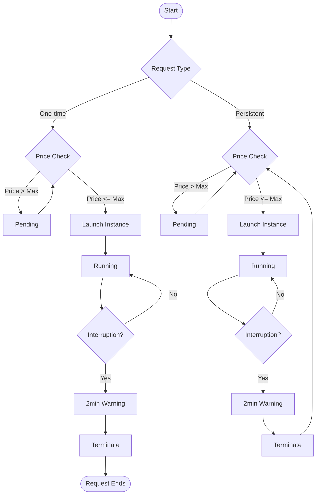

2025-04-06 09:13

Tags: [[AWS EC2]]

---

- When there's some free resource of the amazon system, client can use it. But when it is needed again, client will be disconnected from it
- Cheaper than on-demand (-90%)
- Ideal for flexible start and end time work and can withstand interruption (batch job, data analysis, image process,...)

# How to request
![[Pasted image 20250406094816.png]]
- Define max spot price that you want to pay -> get the instance while current spot price < that value (price may varied base on time and AZ)
- Choose request type `one-time` or `persistance`: if persistance, the request will be auto created again if interrupted
- When the price go higher than your -> can choose to stop/terminate it in 2min

> [!w] Cancel the Spot Request NOT mean the instance is terminated

---
# References