2025-04-07 15:37

Tags: 

---

- Sometimes you may want to control EC2 placement strategy -> using placement groups
- When create a placement strategy, choose 1 of those strategies group: cluster, spread, partition
# Cluster
- instances be grouped into low-latency group, inside a single AZ

```mermaid
graph TB
    subgraph "Cluster Placement Group"
        direction TB
        AZ1["Availability Zone"]
        
        subgraph "Single Rack"
            EC2_1["💻 EC2"]
            EC2_2["💻 EC2"]
            EC2_3["💻 EC2"]
            EC2_4["💻 EC2"]
        end
        
        AZ1 --> EC2_1
        AZ1 --> EC2_2
        AZ1 --> EC2_3
        AZ1 --> EC2_4
    end
```

# Spread
- spreads instances across different AZ (max 7 instances per group per AZ) -> for critical applications

```mermaid
graph LR
    subgraph "Spread Placement Group"
        direction LR
        
        subgraph "AZ 1"
			direction LR

            Rack1["Rack 1"]
            EC2_1["💻 EC2"]
            Rack1 --> EC2_1
        end
        
        subgraph "AZ 2"
	        direction LR
            Rack2["Rack 2"]
            EC2_2["💻 EC2"]
            Rack2 --> EC2_2
        end
        
        subgraph "AZ 3"
	        direction LR
            Rack3["Rack 3"]
            EC2_3["💻 EC2"]
            Rack3 --> EC2_3
        end

    end
```

# Partition
- spread instances across many different partitions (rely on different set of racks) in a 1 or more AZs. Scales to 100s of EC2 instances per group ([[Hadoop]], [[Cassandra]], [[Kafka]])

```mermaid
graph TB
    subgraph "Partition Placement Group"
        direction LR
        
        subgraph "AZ Region"
            subgraph "Partition 1 (Set of racks #1)"
	            direction LR
	            
                EC2_1_1["💻 EC2"]
                EC2_1_2["💻 EC2"]
            end
            
            subgraph "Partition 2 (Set of racks #2)"
	            direction LR
	            
                EC2_2_1["💻 EC2"]
                EC2_2_2["💻 EC2"]
            end
        end
    
    end
```

# Comparison

| Feature        | Cluster                                                                                              | Spread                                                                                                    | Partition                                                                 |
| -------------- | ---------------------------------------------------------------------------------------------------- | --------------------------------------------------------------------------------------------------------- | ------------------------------------------------------------------------- |
| Pros           | - Highest network throughput - Lowest latency                                                     | - Maximum availability - Hardware failure isolation                                                    | - Partition awareness - Good availability                              |
| Cons           | - Single point of failure - Limited to one AZ - Hardware failure affects all                   | - Limited instances per AZ - Normal network performance                                                | - More complex management - Partition awareness needed                 |
| Use Cases      | Performance-critical apps: - Big Data processing - Low-latency applications - HPC workloads | High-availability apps: - Critical applications - Individual instances - High availability needs | Large distributed systems: - HDFS - HBase - Cassandra - Kafka |
| Instance Limit | Hundreds of instances                                                                                | × 7 instances per AZ                                                                                      | Hundreds of instances per partition                                       |

---
# References