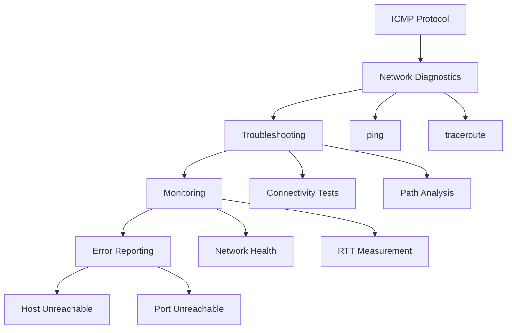

2025-04-05 14:40

Tags: [[Networking]]

---

- Internet Control Message Protocol
- is a [[network layer]] protocol
- used for **diagnostic and control** purposes

# Use cases

# Benefit
✓ Network diagnostics
✓ Error reporting
✓ Path discovery
✓ Network testing
✓ Performance measurement

# Limitation
× Can be blocked by firewalls
× Security concerns
× Limited bandwidth usage
× Not for data transfer
× Can be rate limited

---
# References