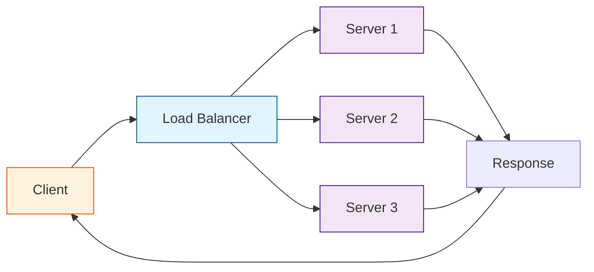

2025-08-13 21:14

Tags: [[Networking]]

---

- Used to distribute the traffic into different targe servers 

```mermaid
graph LR
    Client[Client] --> LB[Load Balancer]
    LB --> Server1[Server 1]
    LB --> Server2[Server 2]
    LB --> Server3[Server 3]
    
    Server1 --> Response[Response]
    Server2 --> Response
    Server3 --> Response
    Response --> Client
    
    classDef loadBalancer fill:#e1f5fe,stroke:#01579b
    classDef server fill:#f3e5f5,stroke:#4a148c
    classDef client fill:#fff3e0,stroke:#e65100
    
    class LB loadBalancer
    class Server1,Server2,Server3 server
    class Client client
```

---
# References