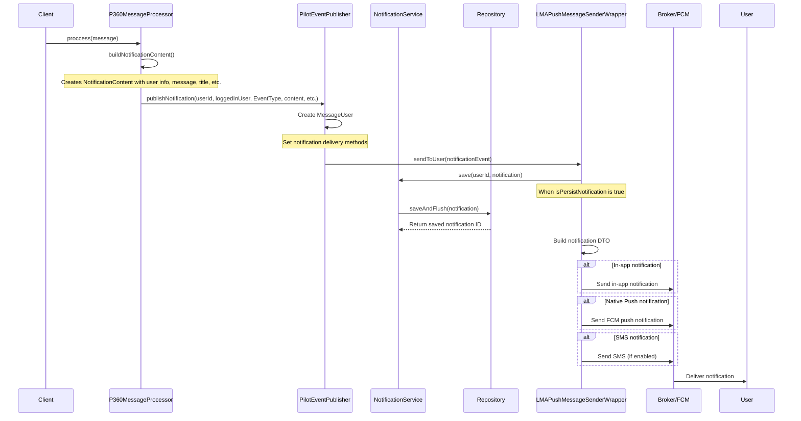

```mermaid
sequenceDiagram
    participant Client
    participant P360MessageProcessor
    participant PilotEventPublisher
    participant NotificationService
    participant Repository
    participant LMAPushMessageSenderWrapper
    participant Broker/FCM
    participant User

    Client->>P360MessageProcessor: proccess(message)
    P360MessageProcessor->>P360MessageProcessor: buildNotificationContent()
    Note over P360MessageProcessor: Creates NotificationContent with user info, message, title, etc.
    
    P360MessageProcessor->>PilotEventPublisher: publishNotification(userId, loggedInUser, EventType, content, etc.)
    
    PilotEventPublisher->>PilotEventPublisher: Create MessageUser
    Note over PilotEventPublisher: Set notification delivery methods
    
    PilotEventPublisher->>LMAPushMessageSenderWrapper: sendToUser(notificationEvent)
    
    LMAPushMessageSenderWrapper->>NotificationService: save(userId, notification)
    Note over LMAPushMessageSenderWrapper: When isPersistNotification is true
    
    NotificationService->>Repository: saveAndFlush(notification)
    Repository-->>NotificationService: Return saved notification ID
    
    LMAPushMessageSenderWrapper->>LMAPushMessageSenderWrapper: Build notification DTO
    
    alt In-app notification
        LMAPushMessageSenderWrapper->>Broker/FCM: Send in-app notification
    end
    
    alt Native Push notification
        LMAPushMessageSenderWrapper->>Broker/FCM: Send FCM push notification
    end
    
    alt SMS notification
        LMAPushMessageSenderWrapper->>Broker/FCM: Send SMS (if enabled)
    end
    
    Broker/FCM->>User: Deliver notification
```

