2025-07-13 17:24

Tags: [[Networking]] 

---

- Network Interface Card
- Also called network card or network adapter
- Is ==hardware== component that ==allow computer to connect to a network==
- Types: 
	- Wired NIC:
		- Ethernet NIC: most common
		- Fiber Optic: use light signal -> for high speed connection
	- Wireless NC:
		- Fi-fi adapters
	- Form factor: built into motherboard
- Data flow

```mermaid
flowchart TD
    %% Outbound Data Flow
    subgraph Outbound ["🔄 Outbound Data Flow (Computer → Network)"]
        App["📱 Application<br/>Sends Data"]
        OS["💻 Operating System<br/>TCP/IP Stack"]
        NIC_Out["🔌 NIC Processing<br/>• Format into frames<br/>• Add MAC addresses<br/>• Error detection"]
        Physical_Out["⚡ Physical Layer<br/>• Convert to electrical/optical signals<br/>• Transmit via cable/wireless"]
        Network_Out["🌐 Network Infrastructure<br/>Switch/Router/Access Point"]
    end
    
    %% Inbound Data Flow
    subgraph Inbound ["🔄 Inbound Data Flow (Network → Computer)"]
        Network_In["🌐 Network Infrastructure<br/>Switch/Router/Access Point"]
        Physical_In["⚡ Physical Layer<br/>• Receive electrical/optical signals<br/>• Convert to digital data"]
        NIC_In["🔌 NIC Processing<br/>• Check MAC address<br/>• Validate frame<br/>• Extract data"]
        OS_In["💻 Operating System<br/>TCP/IP Stack"]
        App_In["📱 Application<br/>Receives Data"]
    end
    
    %% MAC Address Detail
    subgraph MAC ["🏷️ MAC Address Processing"]
        MAC_Check["MAC Address Check<br/>• Destination MAC = My MAC?<br/>• Broadcast/Multicast?<br/>• Promiscuous mode?"]
        Accept["✅ Accept Frame"]
        Discard["❌ Discard Frame"]
    end
    
    %% Outbound Flow
    App --> OS
    OS --> NIC_Out
    NIC_Out --> Physical_Out
    Physical_Out --> Network_Out
    
    %% Inbound Flow
    Network_In --> Physical_In
    Physical_In --> NIC_In
    NIC_In --> MAC_Check
    MAC_Check --> Accept
    MAC_Check --> Discard
    Accept --> OS_In
    OS_In --> App_In
    
    %% Bidirectional network connection
    Network_Out -.->|"Network Medium<br/>(Ethernet Cable/Wi-Fi/Fiber)"| Network_In
    
    %% Styling
    classDef appStyle fill:#e1f5fe,stroke:#0277bd,stroke-width:2px
    classDef osStyle fill:#f3e5f5,stroke:#7b1fa2,stroke-width:2px
    classDef nicStyle fill:#fff3e0,stroke:#ef6c00,stroke-width:2px
    classDef physicalStyle fill:#e8f5e8,stroke:#2e7d32,stroke-width:2px
    classDef networkStyle fill:#fff8e1,stroke:#f57f17,stroke-width:2px
    classDef macStyle fill:#fce4ec,stroke:#c2185b,stroke-width:2px
    
    class App,App_In appStyle
    class OS,OS_In osStyle
    class NIC_Out,NIC_In nicStyle
    class Physical_Out,Physical_In physicalStyle
    class Network_Out,Network_In networkStyle
    class MAC_Check,Accept,Discard macStyle
```

- NIC primarily operate at:
	- Physical Layer
	- Data Link Layer
- Computers often has multiple NIC:
	- Ethernet (wired)
	- Wifi adapter (wireless)
	- Bluetooth (short range)
- There're virtual NIC which used in virtualization env, created by VPN
---
# References