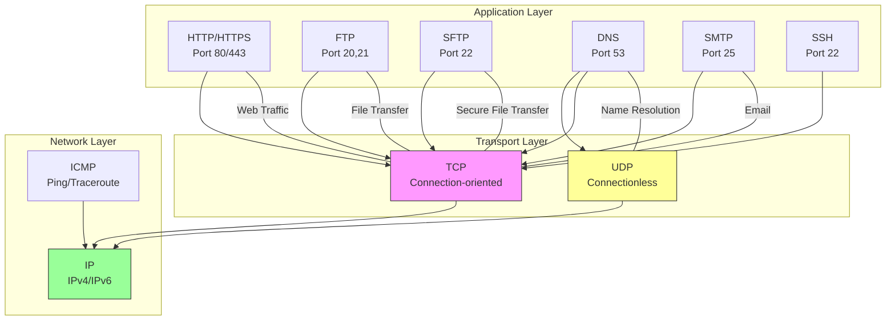

2025-04-05 14:05

Tags: [[Networking]]

---

```mermaid
graph TD
    %% Application Layer Protocols
    subgraph "Application Layer"
        HTTP["HTTP/HTTPS<br/>Port 80/443"]
        FTP["FTP<br/>Port 20,21"]
        SFTP["SFTP<br/>Port 22"]
        DNS["DNS<br/>Port 53"]
        SMTP["SMTP<br/>Port 25"]
        SSH["SSH<br/>Port 22"]
    end

    %% Transport Layer Protocols
    subgraph "Transport Layer"
        TCP["TCP<br/>Connection-oriented"]
        UDP["UDP<br/>Connectionless"]
    end

    %% Network Layer Protocols
    subgraph "Network Layer"
        IP["IP<br/>IPv4/IPv6"]
        ICMP["ICMP<br/>Ping/Traceroute"]
    end

    %% Connections Application -> Transport
    HTTP --> TCP
    FTP --> TCP
    SFTP --> TCP
    SSH --> TCP
    SMTP --> TCP
    DNS --> UDP & TCP
    
    %% Connections Transport -> Network
    TCP --> IP
    UDP --> IP
    ICMP --> IP

    %% Add protocol characteristics
    style TCP fill:#f9f,stroke:#333
    style UDP fill:#ff9,stroke:#333
    style IP fill:#9f9,stroke:#333
    
    %% Add tooltips
    HTTP ---|"Web Traffic"| TCP
    FTP ---|"File Transfer"| TCP
    SFTP ---|"Secure File Transfer"| TCP
    DNS ---|"Name Resolution"| UDP
    SMTP ---|"Email"| TCP
```

---
# References
- [[OSI Model]]
- [[TCP]]
- [[UDP]]
- [[ICMP]]