2025-04-05 14:10

Tags: [[Networking]]

---

```mermaid
graph LR
    subgraph "OSI Model"
        direction LR
        
        L7["Layer 7 - Application<br/>HTTP, FTP, SMTP, DNS<br/>⚙️ User Interface & Services"] -->
        L6["Layer 6 - Presentation<br/>SSL/TLS, JPEG, ASCII<br/>🔄 Data Format & Encryption"] -->
        L5["Layer 5 - Session<br/>NetBIOS, SQL<br/>🤝 Session Management"] -->
        L4["Layer 4 - Transport<br/>TCP, UDP<br/>📦 End-to-End Delivery"] -->
        L3["Layer 3 - Network<br/>IP, ICMP, Router<br/>🌐 Routing & Addressing"] -->
        L2["Layer 2 - Data Link<br/>Ethernet, Switch<br/>🔗 Node-to-Node Delivery"] -->
        L1["Layer 1 - Physical<br/>Cables, Hub<br/>📡 Physical Transmission"]
    end
```

| Layer           | Purpose                                                                    | Protocols/Standards                                                                                    | Functions                                                                                                                             |
| --------------- | -------------------------------------------------------------------------- | ------------------------------------------------------------------------------------------------------ | ------------------------------------------------------------------------------------------------------------------------------------- |
| 7. Application  | - User interface - Network services - Direct user interaction        | - HTTP/HTTPS - [[FTP]]/[[SFTP]] - SMTP/POP3/IMAP - DNS - SSH - [[Telnet]] - [[DHCP]] | - Resource sharing - Remote access - Directory services - Network virtual terminals - File transfers - Email handling  |
| 6. Presentation | - Data format translation - Data representation - Session encryption | - SSL/TLS - JPEG, GIF, PNG - ASCII, EBCDIC - MPEG - MIDI                                   | - Data compression - Data encryption/decryption - Character set conversion - Media formatting - Data transformation       |
| 5. Session      | - Session management - Dialog control - Communication coordination   | - NetBIOS - SQL - RPC (Remote Procedure Call) - NFS - SIP                                  | - Session establishment - Session maintenance - Session termination - Authentication - Authorization - Synchronization |
| 4. Transport    | - End-to-end delivery - Flow control - Error handling                | - [[TCP]] - [[UDP]] - [[SCTP]] - DCCP                                                         | - Segmentation/Reassembly - Connection handling - Error checking - Flow control - Packet sequencing                       |
| 3. Network      | - Logical addressing - Path determination - Packet forwarding        | - [[IPv4]]/[[IPv6]] - ICMP - IGMP - OSPF - BGP - RIP                                    | - Packet routing - IP addressing - Path selection - Traffic control - Subnet handling                                     |
| 2. Data Link    | - Physical addressing - Error detection - Media access               | - Ethernet - MAC addressing - PPP - Frame Relay - ATM                                      | - Framing - Physical addressing - Error control - Flow control - Media access control                                     |
| 1. Physical     | - Bit transmission - Physical topology - Hardware specifications     | - RS-232 - Ethernet - USB - Bluetooth - Wi-Fi                                              | - Bit transmission - Signal encoding - Physical connectivity - Cable specifications - Topology handling                   |

---
# References