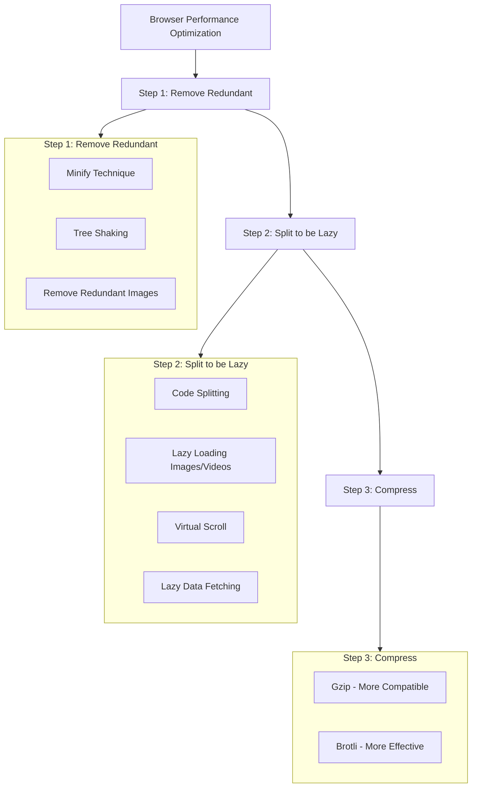

2024-12-31 12:08

Tags: [[Frontend]]

---

# Step 1: Remove redundant

- [[Minify technique]] - remove redundant characters
- [[Tree shaking technique]] - eliminate unused code
- [[Remove redundant size of images]]

# Step 2: Split to be lazy

- After the 1st step, we ensure that all code in the bundled file is useful for the application. But the fact is: Users might not want to see and use all things in your app at once
- Analogy: Your app is a restaurant with 100 dishes in the menu, but each customer can only order some of them
- -> Don't make your chef cook all dishes until customers actually order
  ![[Pasted image 20241231131509.png]]
- Solution: only load what and when users need
- Techniques:
  - [[Code Splitting for Lazy Loading Codes]]
  - [[Lazy loading images or videos]]
  - [[Lazy Rendering with Virtual Scroll]]
  - [[Lazy data fetching]]

# Step 3: Compress

- After we ensure all things are needed, we can compress the file to make it even lighter -> reduce the load time (and the bandwidth also)
- You can choose between gzip - compatible with more browsers and brotli - compress more effectively
  ![[Pasted image 20241231133218.png]]

---

# References
