2025-04-05 09:34

Tags: [[AWS]] [[Security]] [[Networking]]

---
![[Pasted image 20250405132835.png]]

- Is fundamental of network security in AWS
- a ==virtual firewall for [[AWS EC2]] instance or group of instances== (control how traffic allowed in or out of EC2) that perform stateful packet filtering: remember the previous decision that were made

```mermaid
graph LR
    subgraph Internet["🌐 WWW"]
    end

    subgraph SG["🔒 S-Group"]
        EC2["💻 EC2 Instance"]
    end
    
	SG -->|"Outbound Traffic"| Internet
	Internet -->|"Inbound Traffic"| SG
    
```

- Security group regulate:
	- Access to ports
	- Authorized [[IP ranges]] - [[IPv4]] and [[IPv6]]
	- Control inbound/outbound network
- Rules include:
	- Type:
		- Custom [[TCP]]
		- Custom [[UDP]]
		- All TCP
		- All UDP
		- All [[ICMP]]
		- SSH (TCP/22)
		- HTTP (TCP/80)
		- HTTPS (TCP/443)
		- RDP (TCP/3389)
		- PostgreSQL [[Postgres]] (TCP/5432)
		- [[MySQL]]/[[Aurora]] (TCP/3306)
	- Protocol
		- [[TCP]]
		- [[UDP]]
		- [[ICMP]]
		- All protocols
	- Port range: Which part can be connected
		- [[Common TCP Ports]]
	- Source: Who can connect can be referenced by:
		- IP address / IP range (example 1)
		- other SGs (Example 2)
	- Description

> [!i]  By default ==denies all in== traffic and ==allow all out== traffic

- Example 1 (SG referenced by IP): 

Example 2 (SG referenced by other SC):

```mermaid
graph LR
    EC2_Left["💻 EC2 Instance<br/>IP XX.XX.XX.XX"]
    
    subgraph SG1["🔒 Security Group 1<br/>Inbound<br/>Authorising Security Group 1<br/>Authorising Security Group 2"]
    end
    
    EC2_Top["💻 EC2 Instance<br/>IP XX.XX.XX.XX"]
    EC2_Mid["💻 EC2 Instance<br/>IP XX.XX.XX.XX"]
    EC2_Bot["💻 EC2 Instance<br/>IP XX.XX.XX.XX"]
    
    SG2["🔒 Security Group 2<br/>(attached)"]
    SG1_Right["🔒 Security Group 1<br/>(attached)"]
    SG3["🔒 Security Group 3<br/>(attached)"]
    
    SG1 --- EC2_Left
    
    EC2_Top --- SG2
    EC2_Mid --- SG1_Right
    EC2_Bot --- SG3
    
    SG2 -->|"Port 123"| SG1
    SG1_Right -->|"Port 123"| SG1
    SG3 -->|"Port 123 ❌"| SG1

    style EC2_Left fill:#4B96D7
    style EC2_Top fill:#4B96D7
    style EC2_Mid fill:#4B96D7
    style EC2_Bot fill:#4B96D7
    style SG1 fill:#FFA500
    style SG2 fill:#FFA500
    style SG1_Right fill:#FFA500
    style SG3 fill:#gray
```

> [!i] Good to know
> - SG can be attached to multiple instances
> - SG are locked down to a region / [[Amazon VPC (Virtual Private Cloud)]] combination
> - SGs live OUTSIDE the EC2 (if requests are block, EC2 won't even know it)
> - It's good to maintain a separate SG for SSH access

> [!i] If application:
> -  not accessible (timed out) -> SG issue
> - give "connection refused" -> it's application error or application not launched

---
# References