2025-04-05 09:34

Tags: [[AWS]] [[Security]] [[Networking]]

---

- Is fundamental of network security in AWS
- a ==virtual firewall for [[AWS EC2]] instance or group of instances== (control how traffic allowed in or out of EC2):
    - By default ==denies all in== traffic and ==allow all out== traffic
    - Perform stateful packet filtering: remember the previous decision that were made
    - SG rules can be referenced by IP or by other SGs

```mermaid
graph LR
    subgraph Internet["🌐 WWW"]
    end

    subgraph SG["🔒 S-Group"]
        EC2["💻 EC2 Instance"]
    end
    
	SG -->|"Outbound Traffic"| Internet
	Internet -->|"Inbound Traffic"| SG
    
```

- Security group regulate:
	- Access to ports
	- Authorized [[IP ranges]] - [[IPv4]] and [[IPv6]]
	- Control inbound/outbound network
- Rule include:
	- Type
	- Protocol
	- Port range
	- Source
	- Description
- Example:

- Good to know:
	- SG can be attached to multiple instances
	- Locked down to a region / [[VPC]] combination
	- Live OUTSIDE the EC2 (if requests are block, EC2 won't eve know it)

---
# References