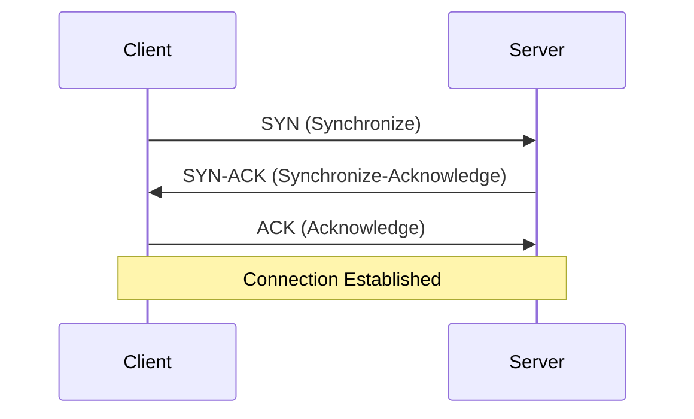
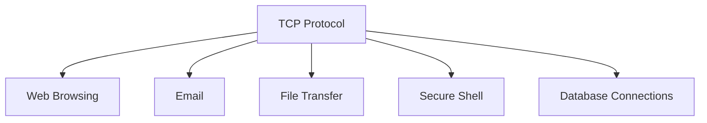

2025-04-05 13:48

Tags: [[Networking]]

---

- Transmission Control Protocol
- a **connection-oriented** protocol that **ensures reliable data delivery**

# Key characteristic

- Connection oriented:
  - Establish connection before send data
  - Maintain connection during transferring data
  - Close connection after completion
- Reliable:
  - Guarantee delivery
  - Orders packets correctly
  - Check for errors
  - Retransmit lost packets

# TCP Handshake (Connection Establish)

# Use cases

---

# References

- [[Common TCP Ports]]
- [[TCP vs UDP]]
