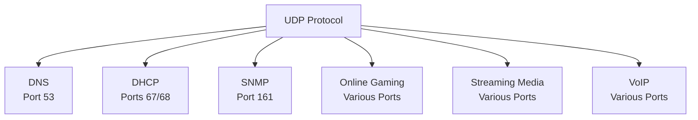

2025-04-05 14:28

Tags: [[Networking]]

---

- User Datagram Protocol
- Is a connectionless [[transport layer]] protocol
# Characteristic
- Connectionless:
	- No handshake required
	- No connection state
	- Just send data immedately
- Speed:
	- Faster (Than [[TCP]])
	- Low latency
	- No overhead
- Less reliability:
	- No guaranteed delivery
	- No packet order
	- Basic error checking only
	- No flow control
# Common ports/application

# Use cases
- Real-time Applications:
	- Video streaming
	- Online gaming
	- Voice over IP (VoIP)
	- Live broadcasts
- DNS Queries:
	- Quick name resolution
	- Single request/response
- Metrics & Monitoring:
	- System logs
	- Network monitoring
	- Performance metrics

> [!s] When to use
> - Speed is critical
> - Real-time data
> - Small queries
> - Lost data is acceptable
> - Application handles reliability

> [!e] When not to use
> - File transfers
> - Database operations
> - Email
> - Web browsing
> - Critical data transmission

---
# References
- [[VoIP]]
- [[SNMP]]
- [[DHCP]]
- [[DNS]]