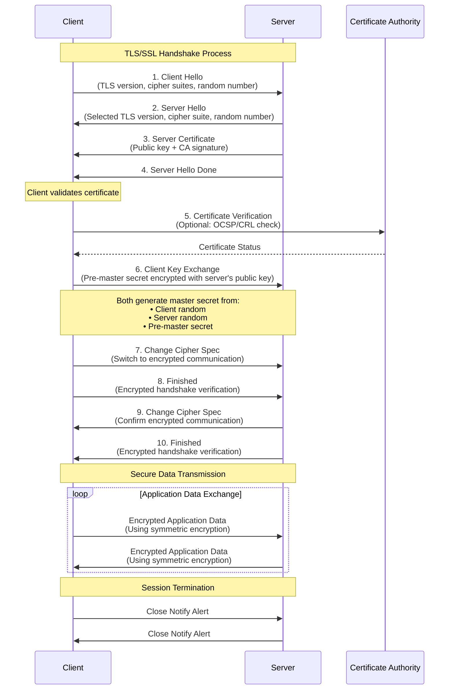

2025-08-24 20:09

Tags: [[Networking]] [[Security]]

---

# Flow

## Handshake Initiation (Steps 1-4)
- Client sends supported TLS versions and cipher suites
- Server responds with selected parameters and its certificate
- Certificate contains the server's public key
## Certificate Verification
- Client validates the server's certificate against trusted CAs
- May check certificate revocation status
## Key Exchange
- Client generates a pre-master secret
- Encrypts it with server's public key and sends it
- Only the server can decrypt this with its private key
## Session Key Generation
- Both parties independently generate the same master secret
- Uses client random (random number from client's initial message) + server random (random number from server's response) + pre-master secret
- Master secret is used to derive symmetric encryption keys
## Handshake Completion
- Both parties switch to encrypted communication
- Exchange encrypted "Finished" messages to verify handshake integrity
## Secure Data Exchange
- All application data is encrypted using symmetric encryption
- Much faster than asymmetric encryption used in handshake
## Session Termination
- Graceful closure with encrypted close notifications

---
# References
- [[Session management strategies]]